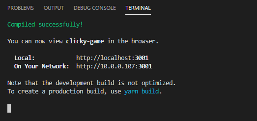
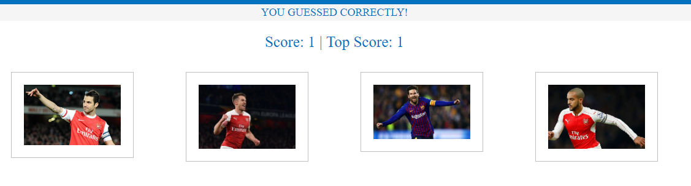

# T.C. Clicky Game

### Overview

The T.C. Clicky Game is a react application, that renders mulitple images that the user is able to click on. The game is build for the purpose to allow users to click on any image of their choice. Once an image is clicked the application will automatically re organize all images. For the user to continue to win he/she must make sure not to click on the same image they previously clicked on.  

### How To Access:

 -- Locally

To download the application onto your own machine please use https://github.com/TomaszChylinski/clicky-game.git.

* Once cloned onto your machine, open the terminal of your choice to the following directory clicky-game .
* Run npm install (installs all dependecies)
* Run npm start to start the application locally
* If the page doesn't open automatically please visit your localhost, see your terminal for the approriate port.

-- Online

* <a href="https://tomaszchylinski.github.io/clicky-game/">https://tomaszchylinski.github.io/clicky-game/</a>

# How To Get Started

* To get started click on one of the images available on the screen.

* Once cliced the user will notice that the images have been randomly re organized

# User Wins

* The continue to increase their score the user has to made sure they don't click on the image they previously selected. The user will be alarmed if they succesfully gained a point. 

# User Looses

* If the user selects the same image twice, their score will be reset back to 0. The user will be alarmed of their mistake. 

Thank you for viewing my T.C. Clicky Game for any question please feel free to visit my portfolio <a href="https://tomaszchylinski.github.io/chylinski-tomasz-portfolio/index.html">page</a>